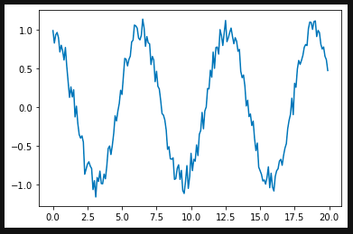
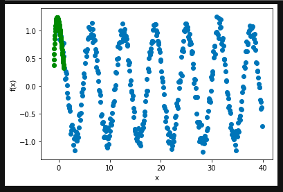
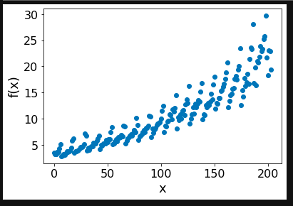

# FinTech-Time-Series
Quantum Machine Learning for FinTech and Time Series Data

## Quantum Neural Networks for FinTech Time Series Function Fitting
This repository is for developing quantum neural network models for fitting one-dimensional time series data and noisy signals. It is modified from the model presented in PennyLane [Function fitting with a quantum neural network](https://pennylane.ai/qml/app/quantum_neural_net.html). We modify the code presented in the default notebook downloaded from PennyLane so that it works using synthetic data created by the user. 



## Training Data
In this very basic setup, there were only 3-layers in the quantum neural network, initialized with random weights. The model went through 100 iterations and had the following training data:

```
Iter:     1 | Cost: 0.6187637 
Iter:     2 | Cost: 0.6263798 
Iter:     3 | Cost: 0.6229809 
Iter:     4 | Cost: 0.6379106 
Iter:     5 | Cost: 0.6496761 
Iter:     6 | Cost: 0.6382834 
Iter:     7 | Cost: 0.6084170 
Iter:     8 | Cost: 0.5811206 
Iter:     9 | Cost: 0.5679852 
Iter:    10 | Cost: 0.5646359 
Iter:    11 | Cost: 0.5642811 
Iter:    12 | Cost: 0.5639005 
Iter:    13 | Cost: 0.5627736 
Iter:    14 | Cost: 0.5609120 
Iter:    15 | Cost: 0.5584790 
Iter:    16 | Cost: 0.5556357 
Iter:    17 | Cost: 0.5525062 
Iter:    18 | Cost: 0.5491704 
Iter:    19 | Cost: 0.5456675 
Iter:    20 | Cost: 0.5420102 
Iter:    21 | Cost: 0.5382083 
Iter:    22 | Cost: 0.5342927 
Iter:    23 | Cost: 0.5303283 
Iter:    24 | Cost: 0.5264091 
Iter:    25 | Cost: 0.5226376 
Iter:    26 | Cost: 0.5191013 
Iter:    27 | Cost: 0.5158557 
Iter:    28 | Cost: 0.5129206 
Iter:    29 | Cost: 0.5102880 
Iter:    30 | Cost: 0.5079359 
Iter:    31 | Cost: 0.5058388 
Iter:    32 | Cost: 0.5039750 
Iter:    33 | Cost: 0.5023272 
Iter:    34 | Cost: 0.5008810 
Iter:    35 | Cost: 0.4996225 
Iter:    36 | Cost: 0.4985366 
Iter:    37 | Cost: 0.4976066 
Iter:    38 | Cost: 0.4968147 
Iter:    39 | Cost: 0.4961433 
Iter:    40 | Cost: 0.4955753 
Iter:    41 | Cost: 0.4950954 
Iter:    42 | Cost: 0.4946899 
Iter:    43 | Cost: 0.4943471 
Iter:    44 | Cost: 0.4940570 
Iter:    45 | Cost: 0.4938110 
Iter:    46 | Cost: 0.4936020 
Iter:    47 | Cost: 0.4934240 
Iter:    48 | Cost: 0.4932719 
Iter:    49 | Cost: 0.4931414 
Iter:    50 | Cost: 0.4930287 
Iter:    51 | Cost: 0.4929309 
Iter:    52 | Cost: 0.4928452 
Iter:    53 | Cost: 0.4927695 
Iter:    54 | Cost: 0.4927019 
Iter:    55 | Cost: 0.4926408 
Iter:    56 | Cost: 0.4925849 
Iter:    57 | Cost: 0.4925333 
Iter:    58 | Cost: 0.4924850 
Iter:    59 | Cost: 0.4924395 
Iter:    60 | Cost: 0.4923963 
Iter:    61 | Cost: 0.4923551 
Iter:    62 | Cost: 0.4923157 
Iter:    63 | Cost: 0.4922780 
Iter:    64 | Cost: 0.4922419 
Iter:    65 | Cost: 0.4922075 
Iter:    66 | Cost: 0.4921746 
Iter:    67 | Cost: 0.4921433 
Iter:    68 | Cost: 0.4921135 
Iter:    69 | Cost: 0.4920850 
Iter:    70 | Cost: 0.4920576 
Iter:    71 | Cost: 0.4920312 
Iter:    72 | Cost: 0.4920054 
Iter:    73 | Cost: 0.4919800 
Iter:    74 | Cost: 0.4919545 
Iter:    75 | Cost: 0.4919287 
Iter:    76 | Cost: 0.4919023 
Iter:    77 | Cost: 0.4918749 
Iter:    78 | Cost: 0.4918464 
Iter:    79 | Cost: 0.4918165 
Iter:    80 | Cost: 0.4917851 
Iter:    81 | Cost: 0.4917521 
Iter:    82 | Cost: 0.4917176 
Iter:    83 | Cost: 0.4916816 
Iter:    84 | Cost: 0.4916440 
Iter:    85 | Cost: 0.4916052 
Iter:    86 | Cost: 0.4915651 
Iter:    87 | Cost: 0.4915239 
Iter:    88 | Cost: 0.4914817 
Iter:    89 | Cost: 0.4914387 
Iter:    90 | Cost: 0.4913950 
Iter:    91 | Cost: 0.4913506 
Iter:    92 | Cost: 0.4913056 
Iter:    93 | Cost: 0.4912601 
Iter:    94 | Cost: 0.4912141 
Iter:    95 | Cost: 0.4911676 
Iter:    96 | Cost: 0.4911206 
Iter:    97 | Cost: 0.4910730 
Iter:    98 | Cost: 0.4910249 
Iter:    99 | Cost: 0.4909763 
Iter:   100 | Cost: 0.4909272 
```

## Prediction Plots
After training the quantum neural network learns to smooth the noisy cosine function as can be seen in the green plots:



## Pharmaceutical Sales
We also provide an example model trained on data from the ```.csv``` file on [Australian pharmaceutical company sales data](https://raw.githubusercontent.com/selva86/datasets/master/a10.csv). 


