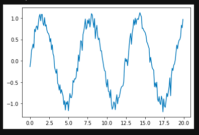
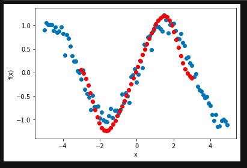

# FinTech-Time-Series
Quantum Machine Learning for [FinTech](https://towardsdatascience.com/ten-applications-of-ai-to-fintech-22d626c2fdac) and Time Series Data

## [Quantum Neural Networks for FinTech](https://eandt.theiet.org/content/articles/2019/04/quantum-on-the-money-fintech-is-banking-on-the-future-of-computing/) Time Series Function Fitting
This repository is for developing quantum neural network models for fitting one-dimensional time series data and noisy signals. It is modified from the model presented in PennyLane [Function fitting with a quantum neural network](https://pennylane.ai/qml/app/quantum_neural_net.html). We modify the code presented in the default notebook downloaded from PennyLane so that it works using synthetic data created by the user, and we train a model on several years worth of drug sales data. 



## Training Data
In this very basic setup, there were only 4-layers in the quantum neural network, initialized with random weights. The model went through 50 iterations and had the following training data:

```
Iter:     1 | Cost: 0.4366430 
Iter:     2 | Cost: 0.4130995 
Iter:     3 | Cost: 0.4401763 
Iter:     4 | Cost: 0.4843044 
Iter:     5 | Cost: 0.5272264 
Iter:     6 | Cost: 0.5590949 
Iter:     7 | Cost: 0.5756194 
Iter:     8 | Cost: 0.5762956 
Iter:     9 | Cost: 0.5631025 
Iter:    10 | Cost: 0.5394853 
Iter:    11 | Cost: 0.5095363 
Iter:    12 | Cost: 0.4773198 
Iter:    13 | Cost: 0.4463337 
Iter:    14 | Cost: 0.4191397 
Iter:    15 | Cost: 0.3972019 
Iter:    16 | Cost: 0.3809405 
Iter:    17 | Cost: 0.3699549 
Iter:    18 | Cost: 0.3633300 
Iter:    19 | Cost: 0.3599337 
Iter:    20 | Cost: 0.3586456 
Iter:    21 | Cost: 0.3584964 
Iter:    22 | Cost: 0.3587285 
Iter:    23 | Cost: 0.3588033 
Iter:    24 | Cost: 0.3583769 
Iter:    25 | Cost: 0.3572647 
Iter:    26 | Cost: 0.3554029 
Iter:    27 | Cost: 0.3528146 
Iter:    28 | Cost: 0.3495813 
Iter:    29 | Cost: 0.3458197 
Iter:    30 | Cost: 0.3416648 
Iter:    31 | Cost: 0.3372562 
Iter:    32 | Cost: 0.3327294 
Iter:    33 | Cost: 0.3282081 
Iter:    34 | Cost: 0.3238007 
Iter:    35 | Cost: 0.3195972 
Iter:    36 | Cost: 0.3156676 
Iter:    37 | Cost: 0.3120615 
Iter:    38 | Cost: 0.3088088 
Iter:    39 | Cost: 0.3059200 
Iter:    40 | Cost: 0.3033888 
Iter:    41 | Cost: 0.3011936 
Iter:    42 | Cost: 0.2993004 
Iter:    43 | Cost: 0.2976666 
Iter:    44 | Cost: 0.2962437 
Iter:    45 | Cost: 0.2949811 
Iter:    46 | Cost: 0.2938298 
Iter:    47 | Cost: 0.2927447 
Iter:    48 | Cost: 0.2916878 
Iter:    49 | Cost: 0.2906292 
Iter:    50 | Cost: 0.2895481 
Iter:    51 | Cost: 0.2884328 
Iter:    52 | Cost: 0.2872799 
Iter:    53 | Cost: 0.2860931 
Iter:    54 | Cost: 0.2848812 
Iter:    55 | Cost: 0.2836566 
Iter:    56 | Cost: 0.2824333 
Iter:    57 | Cost: 0.2812253 
Iter:    58 | Cost: 0.2800452 
Iter:    59 | Cost: 0.2789039 
Iter:    60 | Cost: 0.2778094 
Iter:    61 | Cost: 0.2767668 
Iter:    62 | Cost: 0.2757787 
Iter:    63 | Cost: 0.2748451 
Iter:    64 | Cost: 0.2739643 
Iter:    65 | Cost: 0.2731328 
Iter:    66 | Cost: 0.2723465 
Iter:    67 | Cost: 0.2716004 
Iter:    68 | Cost: 0.2708895 
Iter:    69 | Cost: 0.2702092 
Iter:    70 | Cost: 0.2695549 
Iter:    71 | Cost: 0.2689228 
Iter:    72 | Cost: 0.2683099 
Iter:    73 | Cost: 0.2677134 
Iter:    74 | Cost: 0.2671316 
Iter:    75 | Cost: 0.2665631 
Iter:    76 | Cost: 0.2660070 
Iter:    77 | Cost: 0.2654630 
Iter:    78 | Cost: 0.2649310 
Iter:    79 | Cost: 0.2644110 
Iter:    80 | Cost: 0.2639034 
Iter:    81 | Cost: 0.2634083 
Iter:    82 | Cost: 0.2629260 
Iter:    83 | Cost: 0.2624569 
Iter:    84 | Cost: 0.2620009 
Iter:    85 | Cost: 0.2615582 
Iter:    86 | Cost: 0.2611285 
Iter:    87 | Cost: 0.2607117 
Iter:    88 | Cost: 0.2603074 
Iter:    89 | Cost: 0.2599152 
Iter:    90 | Cost: 0.2595346 
Iter:    91 | Cost: 0.2591651 
Iter:    92 | Cost: 0.2588059 
Iter:    93 | Cost: 0.2584567 
Iter:    94 | Cost: 0.2581168 
Iter:    95 | Cost: 0.2577857 
Iter:    96 | Cost: 0.2574629 
Iter:    97 | Cost: 0.2571479 
Iter:    98 | Cost: 0.2568405 
Iter:    99 | Cost: 0.2565402 
Iter:   100 | Cost: 0.2562468 
```

## Prediction Plots
After training the quantum neural network learns to smooth the noisy sine function as can be seen in the red plots:



## Strawberry Fields and Optical Quantum Computing
This example illustrates an implementation of optical quantum computing and training an optical based quantum neural network. For more information on photonic quantum computing see the [Strawberry Fields documentation](https://arxiv.org/abs/1804.03159). Strawberry Fields is a full-stack library for design, simulation, optimization, and
quantum machine learning of continuous-variable circuits that is fully integrated into PennyLane. For more information on more general quantum nodes, see the [PennyLane documentation](https://pennylane.ai/qml/concepts/quantum_nodes.html).

In later examples of applications of quantum machine learning to FinTech, we will also be investigating [quantum walks](https://link.medium.com/ZsbIWYMAL2). [Quantum walks](https://fintechcircle.com/insights/quantum-machine-learning/) are a quantum analogue to random walks and have substantially reduced the time-consumption in Monte Carlo simulations for mixing of Markov chains as reported by Ashley Montanaro (2015). [These quantum algorithms](https://advances.sciencemag.org/content/4/5/eaat3174.full) are applied for investment strategies in wealth management and trading.
